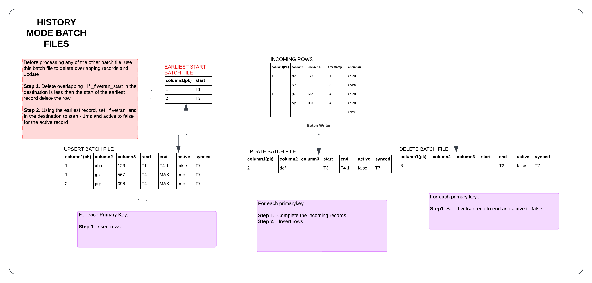

# What is History Mode

[History mode](https://fivetran.com/docs/using-fivetran/features#historymode) allows to capture every available version of each record from Fivetran source connectors.
In order to keep all versions of the records, the following new system columns are added to tables with history mode enabled:


Column | Type | Description
--- | --- | ---
_fivetran_active | Boolean | TRUE if it is the currently active record. FALSE if it is a historical version of the record. Only one version of the record can be TRUE.
_fivetran_start | TimeStamp | The time when the record was first created or modified in the source.
_fivetran_end | TimeStamp | The value for this column depends on whether the record is active. If the record is not active, then `_fivetran_end` value will be `_fivetran_start` of the next version of the record minus 1 millisecond. If the record is deleted, then the value will be the same as the timestamp of the delete operation. If the record is active, then `_fivetran_end` is set to maximum TIMESTAMP value.


### How to track historical changes?  

The following types of files are a part of the `WriteHistoryBatchRequest` gRPC call. These files must be processed in the exact order as described in the following subsections.  

#### `earliest_start_files`

In `WriteHistoryBatchRequest`, we pass a new field, `earliest_start_files`. This file contains a single record for each primary key in the incoming batch, with the earliest `_fivetran_start`. It is also important to note that there can be multiple `earliest_start_files`.

For this file, the following operations must be implemented in the exact order as they are listed:
1. Removing any overlapping records where existing `_fivetran_start` is greater than the earliest `_fivetran_start` timestamp value in the `earliest_start_files` file:
  
   ```sql
   DELETE FROM <schema.table> WHERE pk1 = <val> {AND  pk2 = <val>.....} AND _fivetran_start >= val<_fivetran_start>;
   ```
   > IMPORTANT: The `_fivetran_start` column should NOT be included as part of the primary key filters (`pk1`, `pk2`, etc.) in the WHERE clause or joins. Primary key filters or joins should only include the actual table primary keys (`pk1`, `pk2`, etc.).
   
2. Updating of the values of the history mode-specific system columns `fivetran_active` and `fivetran_end` in the destination. The `fivetran_end` column is set to exactly 1 millisecond earlier than the earliest `_fivetran_start` timestamp value in the `earliest_start_files` file.
    
  ```sql
  UPDATE <schema.table> SET fivetran_active = FALSE, _fivetran_end = _fivetran_start - 1 msec WHERE _fivetran_active = TRUE AND pk1 = <val> {AND  pk2 = <val>.....}`
  ```

#### `update_files`

This file contains records where only some column values were modified in the source. The modified column values are provided as they are in the source whereas the columns without changes in the source are assigned the `unmodified_string` value. For such records, all column values must be populated before the records are inserted to the table in the destination. The column values that are not modified in the source, i.e. that are `unmodified_string`, are populated with the corresponding column's value of the the last active record in the destination, i.e., the record that has the same primary key and `_fivetran_active` set to `true`.

Suppose the existing table in destination is as follows:

ID(PK) | COL1 | COL2 | _fivetran_start(PK) | _fivetran_end | _fivetran_active | _fivetran_synced
--- | --- | --- | --- | --- | --- | --- 
1  | abc  | 1  | T1  | T2-1  | FALSE  | T100
1 | pqr | 2 | T2 | TMAX | TRUE | T101
2 | mno | 3 | T2 | TMAX | TRUE | T103


At the source, the record with ID = 1 is updated:

ID(PK) | COL1 | Timestamp  | Type
--- | --- | --- | ---
1 | xyz | T3 | Updated


and the record with ID = 2 is updated:

Id(PK) |  COL2  | Timestamp  | Type
--- | --- | --- | ---
2 | 1000 | T4 | Updated

And lastly, the record with ID = 1 is updated again:

Id(PK) |  COL1  | Timestamp  | Type
--- | --- | --- | ---
1  | def  | T5  | Updated

The update batch file will be as follows:


ID(PK) | COL1  | COL2 | _fivetran_start(PK) | _fivetran_end | _fivetran_active | _fivetran_synced
--- | --- | --- | --- | --- | --- | --- 
1  | xyz | | T3| T5-1 | FALSE | T107
1 | def | | T5 | TMAX | TRUE | T109
2 | | 1000 | T4 | TMAX | TRUE | T108 


The final destination table will be as follows:

ID(PK) |  COL1  | COL2 | _fivetran_start(PK) | _fivetran_end | _fivetran_active | _fivetran_synced
--- | --- | --- | --- | --- | --- | ---
1  | abc  | 1  | T1  | T2-1msec  | FALSE  | T100
1  | pqr | 2 | T2 | T3-1msec | FALSE | T101
2  | mno | 3 | T2 | T4-1msec | FALSE | T103
1  | def | 2 | T5 | TMAX | TRUE | T109
1  | xyz | 2 | T3 | T5-1msec | FALSE | T107
2  | mno | 1000 | T4 | TMAX | TRUE | T108


The column values that were not modified in the source are set to the values of the active records. In this example, for ID = 2, we didn’t get COL1 value from the source, so we set COL1 to “mno” (COL1 value of the active record in the destination).

#### `replace_files`
Replace files is for upsert operations. For replace files, the column values are inserted in the destination table. This is the case where all column values are modified in the source, as per incoming batch.


#### `delete_files`
For the active record (the one that has `_fivetran_active = TRUE`) with a given primary key in the destination, the `_fivetran_active` column value is set to FALSE, and the `_fivetran_end` column value is set to the `_fivetran_end` column value of the record with the same primary key in the batch file.


 
